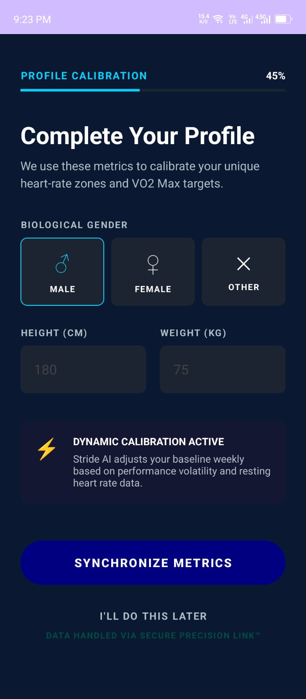
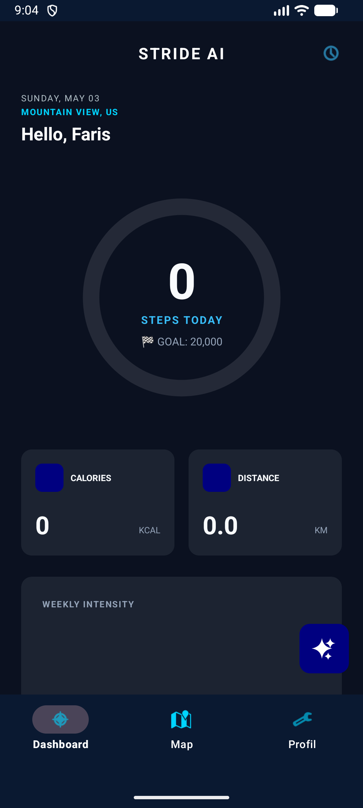
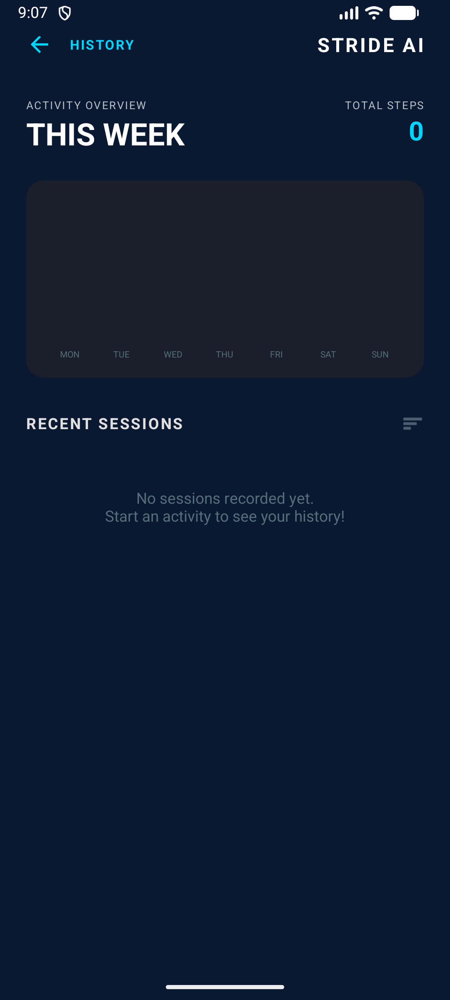
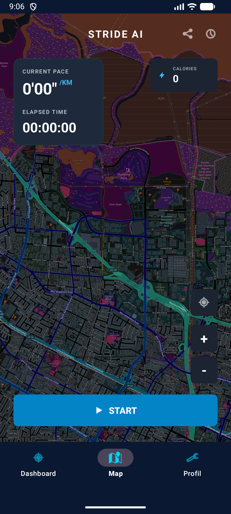
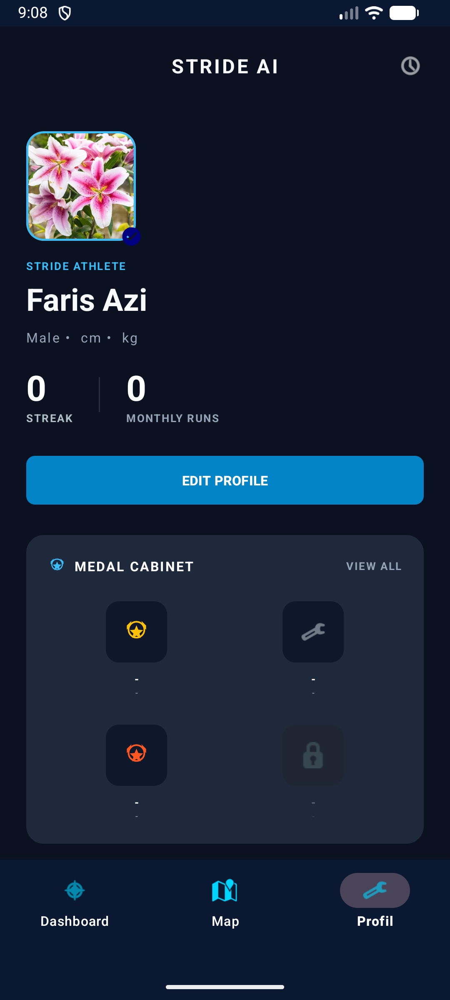
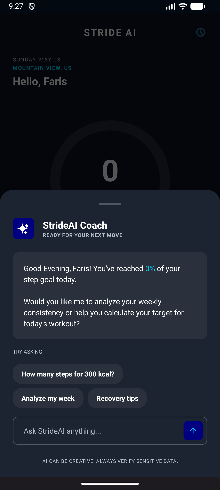

# StrideAI

StrideAI adalah aplikasi pelacakan kebugaran komprehensif di Android yang membantu pengguna untuk melacak langkah harian, melihat riwayat aktivitas, melacak rute lari, dan mendapatkan saran personal dari AI Coach.

## User Interface (UI) Aplikasi

Berikut adalah tampilan dari masing-masing halaman pada aplikasi StrideAI:

### 1. Halaman Login

### 2. Halaman Kalibrasi / Onboarding

### 3. Dashboard Utama

### 4. Riwayat Aktivitas (History)

### 5. Peta & Pelacakan Rute (Map)

### 6. Profil Pengguna

### 7. AI Coach

